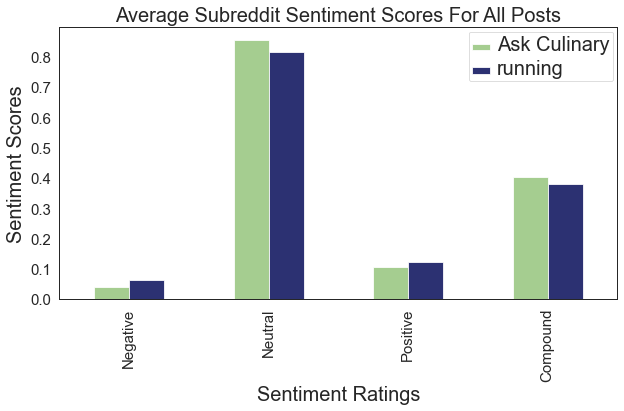
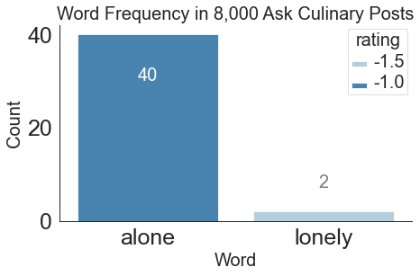
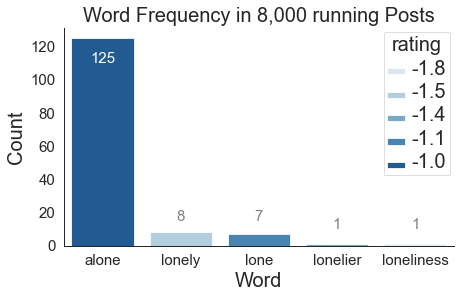
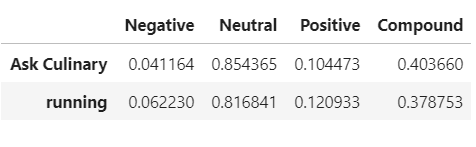

## Reddit Post Natural Language Processing and Classification

## Executive Summary

### Introduction

The team is tasked to model and classify data from two separate Reddit categories, build several classifier models, and a sentiment analyzer. For this project, the two subReddit categories are:

Ask Culinary - a subreddit devoted to food, cooking, sharing recipes, etc. 
 

and Running - a subreddit pertaining to running, jogging, etc. 

### Problem Statement

In today's society, there are many opinions on how to best maintain one's mental health. During the world's current battle with Covid-19, many people are becoming isolated from each other, and living more hours of their day alone.

Is being alone necessarily a bad thing? In regards to text classification, would we expect to see more negative sentiment classifications in text that is more related to solo, or independently performed activities?

Many psychological experts agree that a certain amount of alone time can be helpful to one's mental health, but over time humans express an innate desire to interact with others.

According to a recent article on [https://www.psychalive.org](https://www.psychalive.org), an author states several pros and cons to being alone.

Pros:
 - Allowing our brains to recharge
 - Increasing productivity
 - Boost creativity
 - Gain better understanding of one's self, and better interact with others.

However, the cons of being alone include:
  - Makes us vulnerable to our inner critics.
  - Could lead to painful loneliness
  - Can lead to depression
  - Bad for our health

From the article [Being Alone: The Pros and Cons of Time Alone](https://www.psychalive.org/being-alone/)

So the general consensus of the medical field seems to agree, that too much alone time is not healthy.

In pursuit of seeing that idea in action, I will create some machine learning models to help demonstrate.

Consider the two activities:
* **Cooking**

* **Running**

One could argue that cooking may sometimes be an independent activity, but for the most part pertains to family gatherings, holidays, birthdays and other group social occasions. A chef could also be working in a kitchen with other cooks.

In contrast, running is primarily a solitary activity.  A runner could be in a group, but anyone who has tried to run and talk at the same time knows that even running in groups would not be conducive to social interaction. It is safe to assume that most runners, joggers, or even walkers are doing so independently.

In using the VADER SentimentIntensityAnalyzer, certain search words such as **alone**, **lonely**, and other variations, might prove to be a factor in helping to analyze two subreddit categories of text data.

### Technologies Used

* Data Retrieval

The main tool to download text content from reddit.com is the [Pushshift API](https://pushshift.io/).
This allows a user to specify a subreddit name, and download up to 100 posts in JSON format. Using a for loop to initiate many API calls, we can download over 8,000 posts for the AskCulinary subreddit, and over 8,000 posts for the running subreddit.

* Data Cleaning

The pandas library contains several tools to help clean data. Some reddit posts may have garbage or empty data, or have been removed entirely. Regular expressions also help remove unwanted characters, or word fragments.

CountVectorizer, part of [sklearn's](https://scikit-learn.org/) package, splits up a main body of text into individual words. Unnecessary words can then be easily dropped from the sample data.

* Data Modeling

Modeling is done using many transformers and estimators, all of which are implemented in the sklearn package.

Transformers used:
* CountVectorizer
* TfidfVectorizer

Esimators used:
* KNeighborsClassifier
* RandomForestClassifier
* MultinomialNB

GridSearchCV and Pipeline are also used to implement different hyperparameters, and attempt to optimize each model.

* Sentiment Analysis

A large section of work is doing using SentimentIntensityAnalyzer, part of [nltk.sentiment.vader](https://github.com/cjhutto/vaderSentiment). The Natural Language Toolkit (NLTK), provides several tools to parse and analyze text data.

Every post in both the Ask Culinary and Running subreddits is assigned a compound sentiment score, created by the SentimentIntensityAnalyzer.

These scores are a normalized version of their negative, neutral, and positive rankings, and range from -1 to +1.

The following shows the relative positivity or negativity of all posts in both subreddits.

In order to support the above thesis regarding the link between **lone**-related words and possible negative sentiment, the Ask Culinary and Running datasets are both searched.

In the 8,000 Ask Culinary records, the word **alone** appears 40 times, and the word **lonely** appears twice.

In the 8,000 Running records, the word **alone** appears 125 times, along with lesser occurrences of the words: lonely, lone, lonelier, and loneliness.

Another indicator of the overall negativity vs positivity of the Ask Culinary and Running subreddits, is the average of all of the VADER sentiment compound scores for every post in each subreddit.
This score is calculated with the 9,766 Ask Culinary records, and the 8,081 Running records.

The Ask Culinary average compound sentiment score for it's posts was higher (40.37%) than the running posts, which had a compound sentiment score of 37.88%. This implies on average the Ask Culinary posts were more positive.

### Conclusions

Using the outputs from the VADER SentimentIntensityAnalyzer module, the Running posts do in fact have a more negative overall sentiment. It is still too early to make any large-scale statements about the human behavior or personal well-being of the users of the Ask Culinary group versus the Running users, but the text collected from the Running subReddit does show a clear (albeit slight) negative bias.

More research might continue to shed light on the comparison. Other keywords in the corpus might be a factor, or the presence of certain phrases.  Collecting more data could also be beneficial.  The 16,000 or so posts in this study goes back to July 27, 2020. Both subreddits contain thousands more posts to retrieve.

One large lesson learned while using the SentimentIntensityAnalyzer module, was a problem discovered when loading the default library of stop words supplied by the sklearn module. During the initial passes, the word **alone** could not be found in any of the posts' text data. After much consternation, it was discovered that this key search was actually contained in the stop word file. This was removing it from any Count Vectorizing, and would hide it from the final results. Any data science professional should take care while employing a stop word file. It could create unintended consequences, and skewed data.
